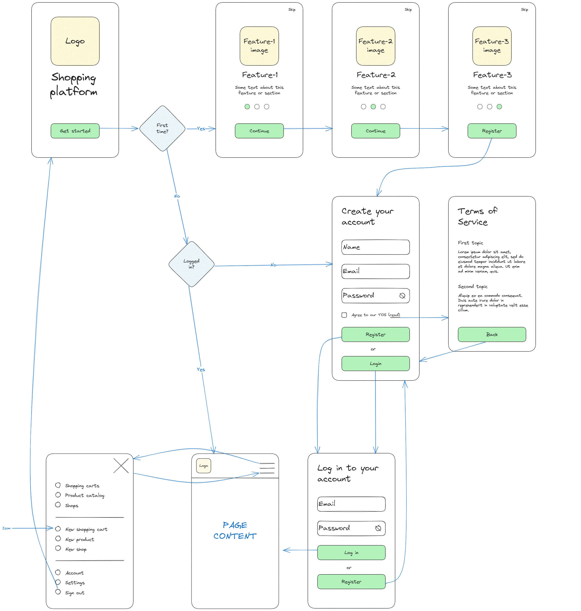

# Shopping platform

_website design project_

<br>

## 🌟 About

This project is about to create a website for mobile about shopping platfotrm. Single student work to create page working with local storage to create new users and valdiate their logins.

This project is for educational porpuses only. Pull request are welcome, but priority for project authors! Thank you for your cooperation!



## 🎯 Project features/goals

-   Github page
-   20 + commits
-   validation of registration form
-   usage of localstorage
-   icons
-   pages and navigation using react
-   slider
-   components quantity
-   list generation

## 🧰 Getting Started

### 💻 Prerequisites

Node.js - _download and install_

```
https://nodejs.org
```

Git - _download and install_

```
https://git-scm.com
```

### 🏃 Run locally

Would like to run this project locally? Open terminal and follow these steps:

1. Clone the repo
    ```sh
    git clone https://github.com/ZygimantasL/44-grupe-mobile-app
    ```
2. Install NPM packages
    ```sh
    npm i
    ```
    or
    ```sh
    npm install
    ```
3. Run the server
    ```sh
    npm start
    ```

### 🧪 Running tests

There is no tests for this project.

## 🌞 Author
Žygimantas: [Github](https://github.com/ZygimantasL)\

## ⚠️ License

Distributed under the MIT License. See LICENSE.txt for more information.
